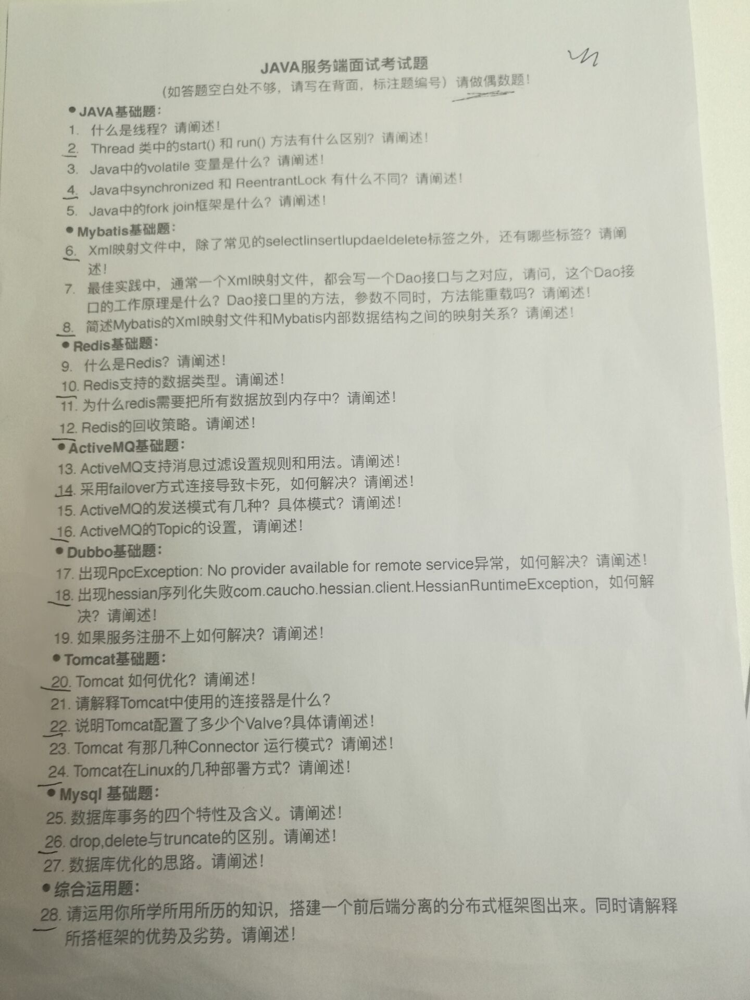

# JAVA架构师面试题

########################################JAVA架构师面试题，如何成为架构师########################################

经常面试一些候选人，整理了下我面试使用的题目，陆陆续续整理出来的题目很多，所以每次会抽一部分来问。答案会在后面的文章中逐渐发布出来。

基础题目

Java线程的状态

进程和线程的区别，进程间如何通讯，线程间如何通讯

HashMap的数据结构是什么？如何实现的。和HashTable，ConcurrentHashMap的区别

Cookie和Session的区别

索引有什么用？如何建索引？

ArrayList是如何实现的，ArrayList和LinkedList的区别？ArrayList如何实现扩容。

equals方法实现

面向对象

线程状态，BLOCKED和WAITING有什么区别

JVM如何加载字节码文件

JVM GC，GC算法。

什么情况会出现Full GC，什么情况会出现yong GC。

JVM内存模型

Java运行时数据区

事务的实现原理

技术深度

有没有看过JDK源码，看过的类实现原理是什么。

HTTP协议

TCP协议

一致性Hash算法

JVM如何加载字节码文件

类加载器如何卸载字节码

IO和NIO的区别，NIO优点

Java线程池的实现原理，keepAliveTime等参数的作用。

HTTP连接池实现原理

数据库连接池实现原理

数据库的实现原理

技术框架

看过哪些开源框架的源码

为什么要用Redis，Redis有哪些优缺点？Redis如何实现扩容？

Netty是如何使用线程池的，为什么这么使用

为什么要使用Spring，Spring的优缺点有哪些

Spring的IOC容器初始化流程

Spring的IOC容器实现原理，为什么可以通过byName和ByType找到Bean

Spring AOP实现原理

消息中间件是如何实现的，技术难点有哪些

系统架构

如何搭建一个高可用系统

哪些设计模式可以增加系统的可扩展性

介绍设计模式，如模板模式，命令模式，策略模式，适配器模式、桥接模式、装饰模式，观察者模式，状态模式，访问者模式。

抽象能力，怎么提高研发效率。

什么是高内聚低耦合，请举例子如何实现

什么情况用接口，什么情况用消息

如果AB两个系统互相依赖，如何解除依赖

如何写一篇设计文档，目录是什么

什么场景应该拆分系统，什么场景应该合并系统

系统和模块的区别，分别在什么场景下使用

分布式系统

分布式事务，两阶段提交。

如何实现分布式锁

如何实现分布式Session

如何保证消息的一致性

负载均衡

正向代理（客户端代理）和反向代理（服务器端代理）

CDN实现原理

怎么提升系统的QPS和吞吐量

实战能力

有没有处理过线上问题？出现内存泄露，CPU利用率标高，应用无响应时如何处理的。

开发中有没有遇到什么技术问题？如何解决的

如果有几十亿的白名单，每天白天需要高并发查询，晚上需要更新一次，如何设计这个功能。

新浪微博是如何实现把微博推给订阅者

Google是如何在一秒内把搜索结果返回给用户的。

12306网站的订票系统如何实现，如何保证不会票不被超卖。

如何实现一个秒杀系统，保证只有几位用户能买到某件商品。

软能力

如何学习一项新技术，比如如何学习Java的，重点学习什么

有关注哪些新的技术

工作任务非常多非常杂时如何处理

项目出现延迟如何处理

和同事的设计思路不一样怎么处理

如何保证开发质量

职业规划是什么？短期，长期目标是什么

团队的规划是什么

能介绍下从工作到现在自己的成长在那里

JAVA架构师的水准：

既然java架构师，首先你要是一个高级java攻城尸，熟练使用各种框架，并知道它们实现的原理。jvm虚拟机原理、调优,懂得jvm能让你写出性能更好的代码；池技术，什么对象池，连接池，线程池...:;java反射技术，写框架必备的技术，但是有严重的性能问题，替代方案java字节码技术;nio，没什么好说的，值得注意的是"直接内存"的特点，使用场景;java多线程同步异步；java各种集合对象的实现原理，了解这些可以让你在解决问题时选择合适的数据结构，高效的解决问题，比如hashmap的实现原理，好多五年以上经验的人都弄不清楚，还有为什扩容时有性能问题？不弄清楚这些原理，就写不出高效的代码，还会认为自己做的很对；总之一句话越基础的东西越重要，很多人认为自己会用它们写代码了，其实仅仅是知道如何调用api而已,离会用还差的远。

熟练使用各种数据结构和算法，数组、哈希、链表、排序树...，一句话要么是时间换空间要么是空间换时间，这里展开可以说一大堆，需要有一定的应用经验，用于解决各种性能或业务上的问题；有时间再补充。

熟练使用linux操作系统，必备，没什么好说的 。

熟悉tcp协议，创建连接三次握手和断开连接四次握手的整个过程，不了解的话，无法对高并发网络应用做优化; 熟悉http协议，尤其是http头，我发现好多工作五年以上的都弄不清session和cookie的生命周期以及它们之间的关联。

系统集群、负载均衡、反向代理、动静分离，网站静态化 。

分布式存储系统nfs,fastdfs,tfs,Hadoop了解他们的优缺点，适用场景 。

分布式缓存技术memcached,redis，提高系统性能必备，一句话，把硬盘上的内容放到内存里来提速，顺便提个算法一致性hash 。

工具nginx必备技能超级好用，高性能，基本不会挂掉的服务器，功能多多，解决各种问题。

数据库的设计能力，mysql必备，最基础的数据库工具，免费好用，对它基本的参数优化，慢查询日志分析，主从复制的配置，至少要成为半个mysql dba。其他nosql数据库如mongodb。

还有队列中间件。如消息推送，可以先把消息写入数据库，推送放队列服务器上，由推送服务器去队列获取处理，这样就可以将消息放数据库和队列里后直接给用户反馈，推送过程则由推送服务器和队列服务器完成，好处异步处理、缓解服务器压力，解藕系统。

以上纯粹是常用的技术，还有很多自己慢慢去摸索吧；因为要知道的东西很多，所以要成为一名合格的架构师，必须要有强大的自学能力，没有人会手把手的教给你所有的东西。

想成为架构师不是懂了一大堆技术就可以了，这些是解决问题的基础、是工具，不懂这些怎么去提解决方案呢？这是成为架构师的必要条件。

架构师还要针对业务特点、系统的性能要求提出能解决问题成本最低的设计方案才合格，人家一个几百人用户的系统，访问量不大，数据量小，你给人家上集群、上分布式存储、上高端服务器，为了架构而架构，这是最扯淡的，架构师的作用就是第一满足业务需求，第二最低的硬件网络成本和技术维护成本。

架构师还要根据业务发展阶段，提前预见发展到下一个阶段系统架构的解决方案，并且设计当前架构时将架构的升级扩展考虑进去，做到易于升级;否则等系统瓶颈来了，出问题了再去出方案，或现有架构无法扩展直接扔掉重做，或扩展麻烦问题一大堆，这会对企业造成损失。

程序员应该需要都有自知之明，会就是会，不会就是不会，互联网发展迅速的时代，只能跟上时代的进步，才不会被淘汰。
