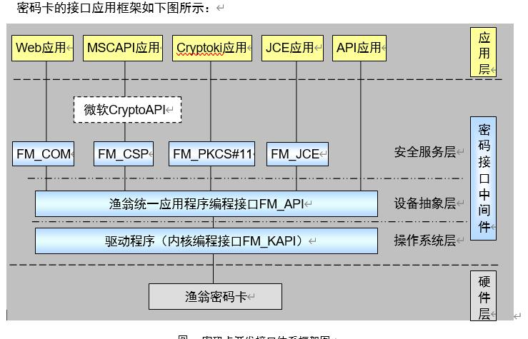
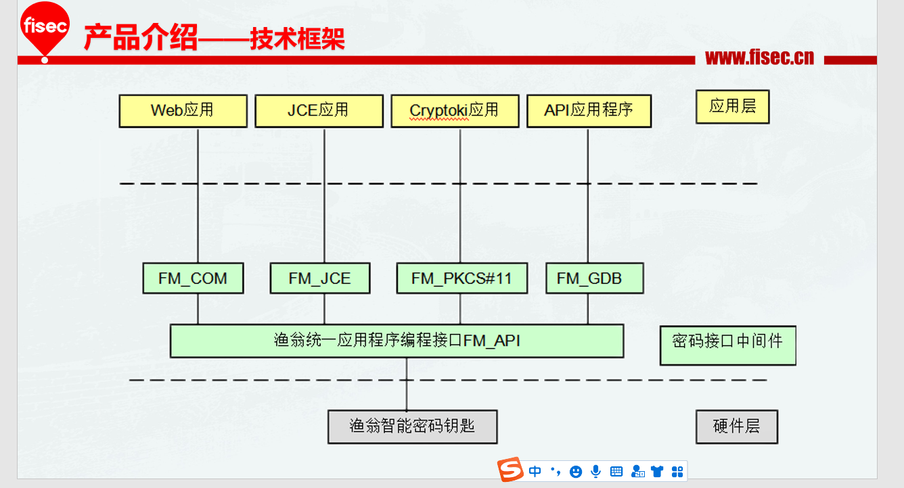
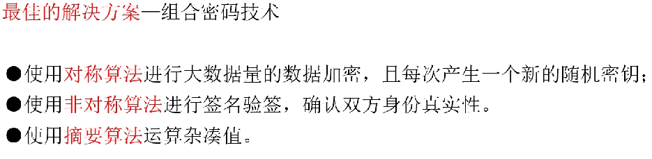
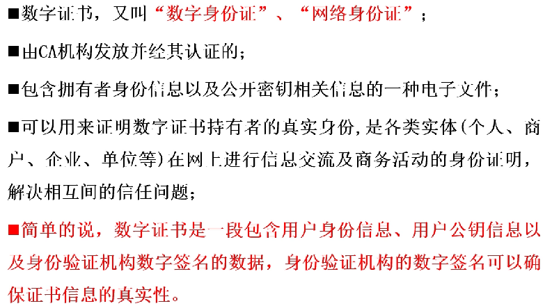
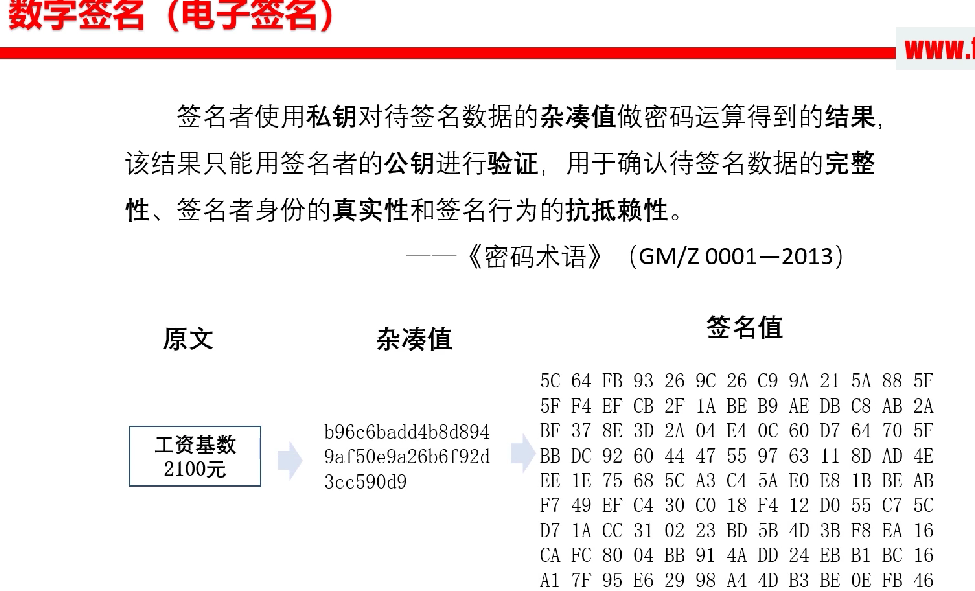
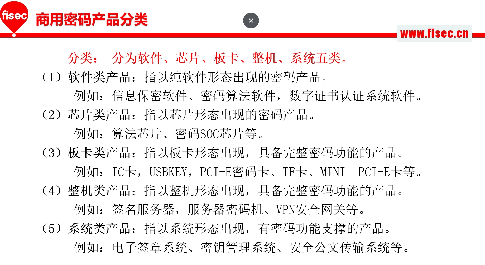

# 密码基础

**加密算法的分类:**

**对称算法**(分组算法):SM1  SM4  SM6 SM7  SSF33  AES,DES,3DES  IDEA

**•优点：计算量小、加密性能高、明文长度不受限制**

**•缺点：在传输前需要先同步密钥**

**•应用场景：数据加密（密钥除外）**

**非对称算法**:SM2 SM9 RSA,DSA,ECC 

•非对称算法是指加密和解密使用不同密钥的算法

•优点：公开密钥可以公开，不需要考虑密钥同步

•缺点：计算量大，性能低

•应用场景：用于认证、密钥加密

- 公开密钥：可以公开的密钥，简称公钥
- 私有密钥：自己秘密保存，不能被其他人获得的密钥，简称私钥
- 加密：使用公钥对原文操作得到密文，非对称加密的原文一般指密钥
- 解密：使用私钥对密文操作得到原文，非对称解密得到的原文一般指密钥
- 签名：使用私钥对原文操作得到签名值的过程
- 验签：使用公钥对签名值进行验证的过程
- 模长：非对称密钥的位数

**摘要算法(**散列算法,哈希算法,杂凑算法): SM3 MD5 SHA1  SHA256 SHA384 SHA512

   •杂凑算法，又叫摘要算法，是将任意长度的原文经过处理后输出特定数值的算法，不同算法输出的数值长度不同。

•特点：原文长度没有要求；不能通过杂凑结果还原出原文。

•应用场景：防篡改。

- **什么是数字证书？**

密码钥匙接口应用框架结构:

 
