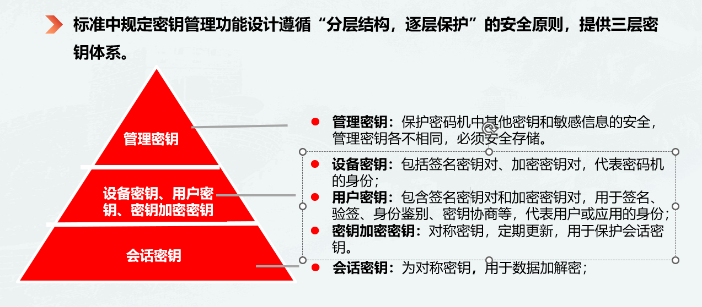

# 进击！进击！进击！

**1.设计模式  �**�

2.计算机组成原理 操作系统  计算机网络   **数据结构与算法�**�  

**3.学习Java虚拟机JVM调优** MAT分析内存溢出 [https://www.jianshu.com/p/5297ee78b8f8](https://www.jianshu.com/p/5297ee78b8f8)

**4.springcloud alibaba 微服务**

**5.消息队列深度研究 ：redis用stream实现消息队列，rabbitMq   kafka�**�

**6.MongoDB****、elasticsearch  redis等NoSql数据库**

**7..JUC并发编程   多线程+线程�**�

**8.高并发高可用解决思路** **分布式锁，分布式事务**

**8.****源码解读�**�**spring mybatis**

**9.mysql深入学习调优 事务 锁 索引 MVCC  存储过程 分库分表 主从复制**

12.研究Netty

13.运维向:Docker K8s.Portainer等容器技术  CICD    

=====================================

优秀开源：

[https://github.com/sorenduan/awesome-java-books](https://github.com/sorenduan/awesome-java-books)

[https://github.com/doocs/advanced-java](https://github.com/doocs/advanced-java)

[https://github.com/qiurunze123/miaosha](https://github.com/qiurunze123/miaosha)

[https://github.com/macrozheng/mall](https://github.com/macrozheng/mall)

[https://github.com/abel533/spring-rabbitmq-demo](https://github.com/abel533/spring-rabbitmq-demo)

[https://github.com/Snailclimb/JavaGuide](https://github.com/Snailclimb/JavaGuide)

[https://javaguide.cn/](https://javaguide.cn/)

学习路线[https://www.bilibili.com/read/cv5216534?spm_id_from=333.788.b_636f6d6d656e74.8](https://www.bilibili.com/read/cv5216534?spm_id_from=333.788.b_636f6d6d656e74.8)

**学习mall、mall-swarm  和ruoyicloud 项目**

****
