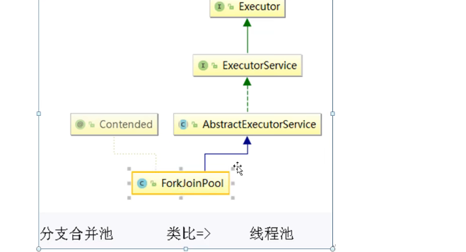

# JUC并发编程笔记

更详细笔记见：[https://blog.csdn.net/weixin_47872288/article/details/119453092](https://blog.csdn.net/weixin_47872288/article/details/119453092)

Fork/join

=======================================================
