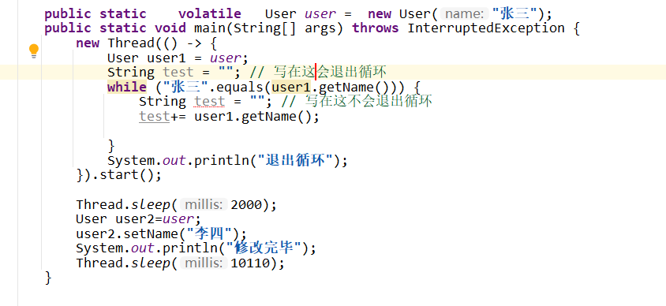

先看代码

```
public static     User user =  new User("张三");
 public static void main(String[] args) throws InterruptedException {
     new Thread(() -> {
         StringBuilder aaa= new StringBuilder();
         while ("张三".equals(user.getName())) {
             aaa.append(user1.getName());
         }
         System.out.println("退出循环");
         System.out.println(aaa);
     }).start();

     Thread.sleep(2000);
     user.setName("李四");
     System.out.println("修改完毕");
     Thread.sleep(10110);

 }
```

如果没有   aaa.append(user1.getName()); 这一句 则不会退出循环的 ,原因 虽然有另一个线程修改了主内存中user的内存   但是循环里并没有访问user(即便不是空循环 也不行),所以会一直拿**线程缓存**中的user

这一句换成 System.out.println("随便打印点什么");  或者 Thread.yield()    或者 Thread.sleep()  都可以使循环退出  ,  原因是这三个操作 都会使线程重新读取主内存 .  

或者将user 改为用 volitile  修饰 , 强制使每次读取 user 都从主内存中读, 也能退出循环.


**疑问:**  为什么   "张三".equals(user.getName())这一句不会重新读主内存(即便放在while 循环体中也不行 ) 而   aaa.append(user1.getName()); 会读主内存?


原因:

`StringBuilder.append` 在执行时，可能会调用系统 I/O 操作，虽然不是直接的文件 I/O，但是它涉及对字符串缓冲区的写入操作。Java 在这种缓冲区相关的操作上通常会触发主内存刷新，确保字符串数据的可见性。

这种刷新主内存的行为是由 JVM 的内存模型管理的，可以理解为 `StringBuilder.append()` 帮助触发了线程缓存刷新，确保读取到最新的 `user.getName()` 的值。


=============

还要注意 volitile  只会影响自己 ,不会影响已经赋给其他的变量

比如下面的代码

```
public static    volatile   User user =  new User("张三");
public static void main(String[] args) throws InterruptedException {
    new Thread(() -> {
        User user1 = user;
        while ("张三".equals(user1.getName())) {
        }
        System.out.println("退出循环");
    }).start();

    Thread.sleep(2000);
    User user2=user;
    user2.setName("李四");
    System.out.println("修改完毕");
    Thread.sleep(10110);
}
```

这种就不会退出循环, 因为user2的name设置为李四, 会使user1和user 都变为李四,  但并不会退出循环,  因为user是被volatile修饰的 , 但user1 没有， 所以循环时还是取的线程缓存 所以一直是张三不会跳出循环




还有个为什么要给你道歉的理由  我说出来你可能觉得挺扯的  

你的长相 气质包括声音 都真的特别像我高中同桌  第一次见到我都惊呆了，还能有这么像的人


