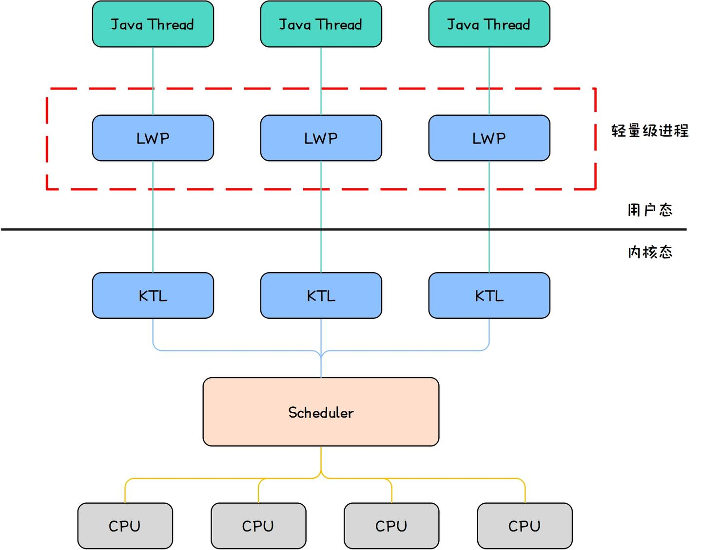
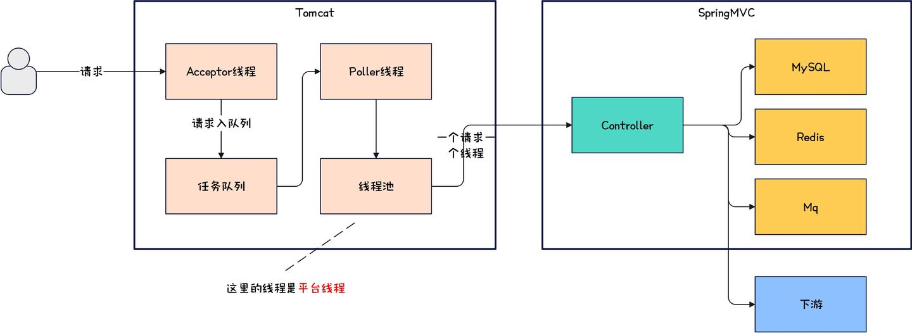
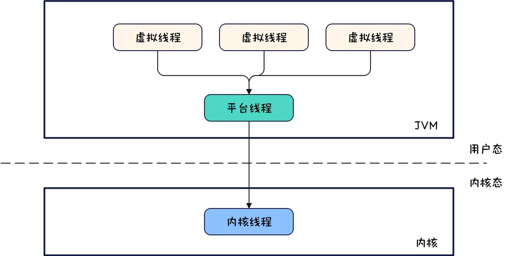
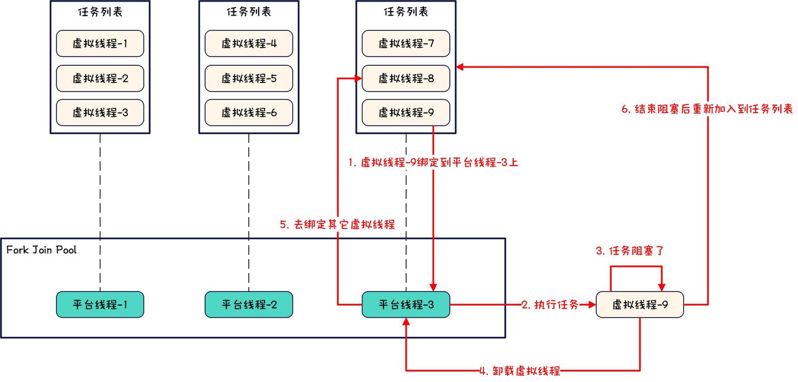

# ✨JDK21✨虚拟线程彻底杀死响应式编程

------

### 前言

在**2023**年**9**月**19**日正式发布的**JDK21**引入了 ***`虚拟线程`\***，其是一种轻量化的[用户线程](https://zhida.zhihu.com/search?content_id=253534830&content_type=Article&match_order=1&q=用户线程&zhida_source=entity)，让**Java**中的线程实现了从 ***`内核线程`\*** 向 ***`用户线程`\*** 的切换。

传统的**Java**线程模型，可以认为一个**Java**线程映射到一个**KLT**（**Kernel-Level Thread**，*内核线程*），示意图如下。

这种线程模型最大缺点有两点。

1. 线程调度由内核调度器完成，涉及内核态与用户态切换；
2. 操作系统支持的**KTL**有限。Java

上述缺点导致**Java**应用一直被诟病无法支持高并发，常常被**Golang**和**Lua**等支持 ***`协程`\*** 的语言在并发支持上踩一脚，而现在**JDK21**中的虚拟线程，其实就等同于**Golang**等语言中的协程，可以说虚拟线程的出现，狠狠的削弱了支持协程的语言的气焰，同时也彻底让悬在响应式编程头上的达尔摩斯之剑彻底斩下。

那么现在就跟随本文的视角，一起看看虚拟线程是如何彻底杀死响应式编程的吧。

### 正文

首先用下图来示意一个请求来到应用后的处理路径。

每个请求最终会由**[Tomcat](https://zhida.zhihu.com/search?content_id=253534830&content_type=Article&match_order=1&q=Tomcat&zhida_source=entity)**维护的线程池中的一个线程来处理，并且这里的线程是**平台线程**，这种处理模型称为 **thread-per-request**，这种情况下，只要请求没有被处理完，线程池中的线程就会一直被占用，所以**Tomcat**维护的线程池中的线程数就决定了当前进程同时能支持的并发请求数，默认情况下**Tomcat**使用**BIO**连接器时线程池中的最大线程数是**200**，也就是说默认情况下当前进程的最大并发请求就是**200**。

如果想要提高并发，在应用处理请求速度不变的情况下，简单有效的途径就是增加**Tomcat**的线程池的最大线程数，这是最直接的手段，但是由此带来如下问题。

1. 无法不受限的增加线程数。因为这里的线程是平台线程，底层映射着一个**KTL**内核线程，而操作系统支持的**KTL**是有限的，故增加线程数是很受限的；
2. 线程增多意味着频繁的线程调度。平台线程的调度由内核调度器完成，意味着会频繁发生内核态和用户态的切换，这会带来性能开销；
3. **IO**密集型程序会存在大量阻塞线程。如果应用程序有请求数据库，请求缓存或者请求下游等操作，那么对应的线程其实就阻塞在了**IO**上，造成了尽管线程很多，但是干活儿的线程却很少的情况。

要解决上面的问题，在虚拟线程出来之前，诞生了响应式编程这个中间产物，响应式编程希望通过 ***`缓冲区`\*** 加 ***`回调`\*** 的方式来让所有线程呈现一种非阻塞的状态，力求实现让少量线程一直忙的效果，例如使用响应式客户端去请求下游，那么线程不会阻塞在网络**IO**上，而是会去处理其它任务。

关于响应式编程，具体可见[糟糕的响应式编程](https://link.zhihu.com/?target=https%3A//juejin.cn/post/7464824759252107264)，这里不再赘述，但关于响应式编程的缺点，这里一定要说，下面是响应式编程的 ***`三宗罪`\***。

1. 代码看不懂。响应式编程的代码的可读性超级差，代码极其不直观，操作全都封装成一个个的回调函数，回调里面再嵌一个回调，污染眼睛；
2. 难以调试。在回调函数里打断点根本看不到是从哪里调用过来的，传统的阻塞式编程根据栈帧就能一步一步的找到调用方，但响应式编程的调用链路根本就看不懂，要是在回调函数里抛出了异常就更乐了，异常的堆栈就是废话文学；
3. 学习成本高。大部分程序员都是阻塞式思维，如果使用响应式编程，思维得首先切换，其次要学习大量的**API**的使用，关键在于掌握之后还要别扭的去写和看，虐待自己，恶心他人。

身背三宗罪的响应式编程，还没开始发力，就因为**JDK**虚拟线程的出现而被彻底杀死了，下面用一张图来快速理解虚拟线程的线程模型。

虚拟线程的调度由**JVM**实现，避免了线程调度带来的用户态到内核态的性能开销，并且多个虚拟线程以一个平台线程作为载体，当平台线程承载的虚拟线程阻塞时，平台线程会自动卸载阻塞的虚拟线程转而去承载其它虚拟线程。

发现没，虚拟线程最终的思路其实和响应式编程是**一样的**，让少量平台线程一直跑，只不过响应式编程需要我们更改应用层代码，而虚拟线程把实现下沉到了**JVM**，使用虚拟线程后，我们可以用阻塞式编程的代码享受到和使用响应式编程一样的性能提升，而且更加的方便和简单。

下面这张图更加细致的揭示了虚拟线程的工作原理。

有两点需要做一下说明。

1. 每个平台线程对应一个虚拟线程**任务列表**。平台线程会从虚拟线程任务列表中获取虚拟线程进行绑定；
2. 平台线程所在的线程池是**Fork Join Pool**线程池。如果平台线程对应的虚拟线程任务列表中的虚拟线程**全部**处于阻塞，平台线程可以去窃取其它平台线程的虚拟线程来绑定。

相信到这里，只能感叹虚拟线程实在是 ***`优雅`\***。

但虚拟线程**并非完美**的，因为虚拟线程只是更加优雅的做了响应式编程想做的事情，但是响应式编程无法解决的问题，虚拟线程也无法解决，响应式编程最大的功能性问题在于仅在**IO**密集型应用中有较大性能提升，如果是计算密集型，往往会适得其反，而这恰恰也是虚拟线程的局限性。

现在**Tomcat**在**11.0**版本，**Jetty**在**12.0**版本均已支持虚拟线程，相信随着**JDK**版本升级的普及，**Java**的并发性能会越来越高。

### 总结

响应式编程和虚拟线程的思想是**一致**的，让少量平台线程一直有任务执行，从而解决平台线程调度的性能开销并极大提升并发能力，也就是更少的平台线程做了更多的事情。

但响应式编程的代价就是更改编程习惯，代码难看，难以调试以及学习成本大，响应式编程带来的收益完全**无法抵消**其带来的麻烦，而虚拟线程优雅的解决了响应式编程的麻烦，不用更改编程习惯，我们使用虚拟线程就像使用平台线程一样，没有学习成本，简单易用。

响应式编程和虚拟线程一样，仅用于解决**IO**密集型应用面临的并发瓶颈，没办法用于计算密集型应用，但只要有得选，一定是虚拟线程，响应式编程彻底被虚拟线程杀死。