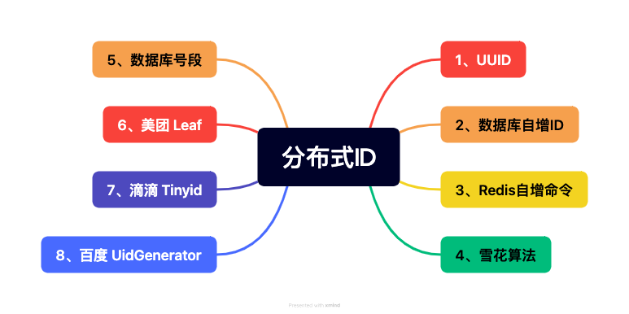
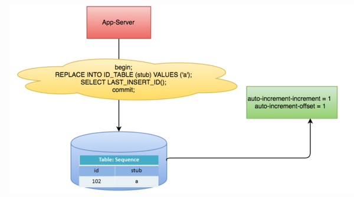
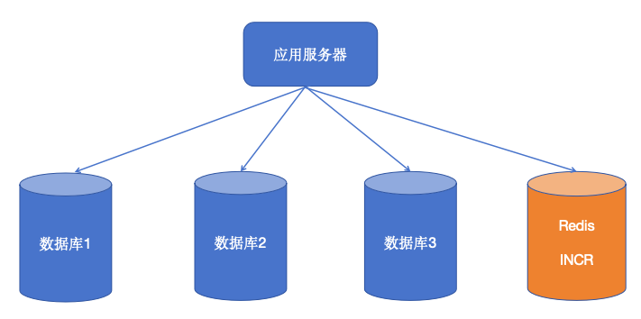
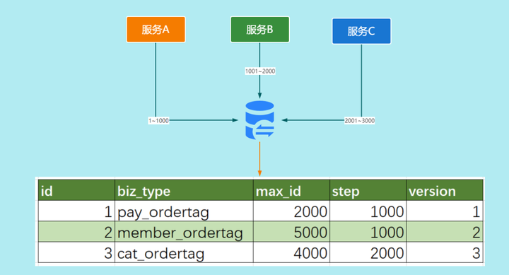
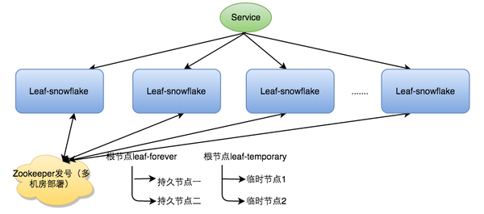
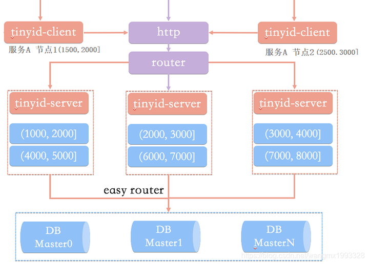
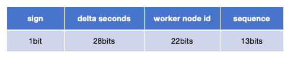

**uuid和[雪花算法](https://zhida.zhihu.com/search?content_id=676930791&content_type=Answer&match_order=1&q=雪花算法&zhida_source=entity)都不是趋势递增的，在未进行分库分表的情况下，不要用它们做数据库的主键ID，这样会导致MySQL的页分裂问题，以及磁盘的随机读问题。**

**不过，雪花算法是可以作为分布式数据库主键的，这是个主流的技术实现方案。**

我给你多介绍几种分布式ID吧，供你参考。

近两年的技术面试，分布式系列是面试官经常会问到的一个高频方向，比如：分布式事务、[分布式锁](https://zhida.zhihu.com/search?content_id=676930791&content_type=Answer&match_order=1&q=分布式锁&zhida_source=entity)、分布式调度、分布式存储、分布式ID等。

今天我们就来聊聊，这里面相对简单的分布式ID，首先说下，我们为什么需要分布式ID？

当系统数据量过大，已经进行分库分表后，我们需要对分散在各个库表中的数据记录进行唯一标识，而分布式ID恰好用来解决这个问题。

接下来，我们看看八大分布式ID的生成方案，以及各自的优缺点是什么。



首先，分享一套我自己逐字写的、深入浅出、细致易懂的高频面试题详解（之前在某鱼上卖199的），旨在以**一站式刷题 + 解惑**的方式帮你提升学习效率，需要的请自取。


[amp.weixin.qq.com/s?__biz=MzkxMDUxNzM2Nw==&mid=2247484894&idx=1&sn=920715e633964de11dfa47bff3b6b12c&chksm=c12b70c6f65cf9d0feb54b096976ee6b986195fa1584c183a67c327a0fe6df8ecaccb12d51e5&token=1790900296&lang=zh_CN#rd](https://link.zhihu.com/?target=https%3A//mp.weixin.qq.com/s%3F__biz%3DMzkxMDUxNzM2Nw%3D%3D%26mid%3D2247484894%26idx%3D1%26sn%3D920715e633964de11dfa47bff3b6b12c%26chksm%3Dc12b70c6f65cf9d0feb54b096976ee6b986195fa1584c183a67c327a0fe6df8ecaccb12d51e5%26token%3D1790900296%26lang%3Dzh_CN%23rd)


强烈建议近期有求职诉求的Javaer好好看看。

###  1、[UUID](https://zhida.zhihu.com/search?content_id=676930791&content_type=Answer&match_order=1&q=UUID&zhida_source=entity)

UUID是 Universally Unique Identifier 的缩写，翻译成中文为“通用唯一识别码”，由32个16进制数字 + 4个“-”构成，整体长度为36，其可以保证唯一性，发生碰撞的概率极低。

UUID目前有5个版本，每个版本都有不同的生成方式。目前最常用的是版本4，通过随机数的方式生成。

UUID的生成实现方式非常简单，可以通过java.util包，一行代码即可实现。

```text
import java.util.UUID;
 
public class Test {
    public static void main(String[] args) {
        System.out.println(“本次生成的UUID为” + UUID.randomUUID());
    }
}

//打印结果
//本次生成的UUID为：05cb2d06-1aca-4121-acb0-dfafce04dc46
```

**优点：**

（1）技术实现简单，一行代码即可。 （2）本地即可生成，出错率低。 （3）ID生成性能高。

**缺点：**

（1）无序，影响数据库的数据写入性能。 （2）存储成本高，就算去掉4个“-”，长度也是32。 （3）可读性差。

### 2、数据库自增ID

选择一个数据库作为中央数据库，利用该库中某表的自增主键机制生成分布式ID。



对应SQL语句如下：

```text
REPLACE INTO id_table (stub) values (’a‘) ;
SELECT LAST_INSERT_ID();
```

该SQL语句可以使 id_table 表中在保持一条数据记录的情况下，主键ID持续递增。

**优点：**

（1）单调递增，不会影响数据库的数据写入性能。 （2）可读性高。

**缺点：**

（1）ID生成涉及到数据库操作，性能不高。 （2）需要额外引入中央数据库，链路变长导致出错概率增加。 （3）开发成本相对较高。 （4）数据库压力大。

### 3、Redis自增命令

通过Redis的INCR自增命令来生成分布式ID。



如下所示：

```text
127.0.0.1:6379> set distributed_id 1     // 将分布式ID初始化为1
OK
127.0.0.1:6379> incr distributed_id      // +1，并返回结果
(integer) 2
```

**优点：**

（1）单调递增，不会影响数据库的数据写入性能。 （2）ID生成性能高。 （3）可读性高。

**缺点：**

（1）需要额外引入Redis，链路变长导致出错概率增加。 （2）Redis宕机后，RDB + AOF数据恢复较慢，需要Plan B提升恢复速度。 （3）开发成本相对较高。

###  4、雪花算法

雪花算法（[SnowFlake](https://zhida.zhihu.com/search?content_id=676930791&content_type=Answer&match_order=1&q=SnowFlake&zhida_source=entity)），是Twitter公司开源的分布式ID生成算法，在本地引入hutool jar包即可实现。

雪花算法生成的分布式ID共64位，由4个部分组成。


- 第一部分：1位。 固定为0，表示为正整数。二进制中最高位是符号位，ID为正整数，所以固定为0。
- 第二部分：41位。 表示精确到毫秒的时间戳，时间戳带有自增属性，可以使用69年。
- 第三部分：10位。 表示10位的机器标识，最多支持1024个节点。
- 第四部分：12 位。 表示自增序列，可以支持同一节点同一毫秒生成最多4096个ID。

**优点：**

（1）技术实现简单，开发成本低。 （2）趋势递增，不会影响数据库的数据写入性能。 （3）本地即可生成，出错率低。 （4）ID生成性能高。

**缺点：**

（1）强依赖机器时钟，如果机器上时钟回拨，会导致ID重复。 （2）可读性差。

###  5、数据库号段

数据库号段，是在“数据库自增ID”方案上做的优化，实现方式如下：

（1）从中央数据库中获取出一批分布式ID，并缓存到分布式ID服务本地，业务系统获取分布式ID的时候，可直接在这个批次内递增取值。 （2）若该批次分布式ID的号段用完，则需要更新数据库中的初始值，再次获取新批次的分布式ID，并重新缓存到分布式ID服务本地，以供使用。



```text
CREATE TABLE id_generator (
  id int(10) NOT NULL,
  max_id bigint(20) NOT NULL COMMENT '当前最大id',
  step int(10) NOT NULL COMMENT '号段的长度',
  biz_type int(10) NOT NULL COMMENT '业务类型',
  version int(10) NOT NULL COMMENT '版本号,是一个乐观锁，每次都更新version，保证并发时数据的正确性',
  PRIMARY KEY (`id`)
)
```

**优点：**

（1）趋势递增，不会影响数据库的数据写入性能。 （2）ID生成性能高。 （3）数据库压力小。 （4）可读性高。

**缺点：**

（1）开发成本很高。 （2）需要额外引入分布式ID服务和中央数据库，链路变长导致出错概率增加。

###  6、[美团 Leaf](https://zhida.zhihu.com/search?content_id=676930791&content_type=Answer&match_order=1&q=美团+Leaf&zhida_source=entity)

Leaf，是美团技术团队实现的[分布式ID生成方案](https://zhida.zhihu.com/search?content_id=676930791&content_type=Answer&match_order=1&q=分布式ID生成方案&zhida_source=entity)，实现了数据库号段模式（Leaf-segment）和雪花算法模式（[Leaf-snowflake](https://zhida.zhihu.com/search?content_id=676930791&content_type=Answer&match_order=1&q=Leaf-snowflake&zhida_source=entity)），我们这里着重说Leaf-snowflake。

Leaf-snowflake方案完全沿用snowflake算法方案的bit位设计，即：以“1+41+10+12”的方式组装ID号，改动点为：将SnowFlake从本地jar包变成了独立服务，并引入了[Zookeeper](https://zhida.zhihu.com/search?content_id=676930791&content_type=Answer&match_order=1&q=Zookeeper&zhida_source=entity)来解决时钟回拨问题。



**优点：**

（1）趋势递增，不会影响数据库的数据写入性能。 （2）解决了原有的机器上时钟回拨，会出现的ID重复问题。 （3）ID生成性能高。

**缺点：**

（1）第三方开源软件，有一定的熟悉和试错成本。 （2）需要额外引入分布式ID服务和Zookeeper，链路变长导致出错概率增加。 （3）可读性差。

### 7、滴滴 Tinyid

Tinyid，是滴滴技术团队实现的分布式ID生成算法，基于上文介绍的号段模式实现，在此基础上支持数据库多主节点模式，还提供了tinyid-client客户端的接入方式。

除此之外，Tinyid做的另一个优化点是号段预加载。

举个例子：当前可用号段（1——1000）被加载到内存，获取id时会从1开始递增获取，当使用到20%（默认）时，会异步加载下一可用号段（4001——5000）到内存，此时内存中可用号段为（201——1000）和（4001——5000）。

当id递增到1000时，当前号段使用完毕，下一号段会替换为当前号段，以此类推。




**优点：**

（1）趋势递增，不会影响数据库的数据写入性能。 （2）ID生成性能高。 （3）数据库压力小。 （4）可读性高。

**缺点：**

（1）第三方开源软件，有一定的熟悉和试错成本。 （2）需要额外引入分布式ID服务和中央数据库，链路变长导致出错概率增加。

### 8、百度 [UidGenerator](https://zhida.zhihu.com/search?content_id=676930791&content_type=Answer&match_order=1&q=UidGenerator&zhida_source=entity)

UidGenerator是Java实现的，基于[Snowflake](https://zhida.zhihu.com/search?content_id=676930791&content_type=Answer&match_order=1&q=Snowflake&zhida_source=entity)算法的唯一ID生成器。UidGenerator以组件形式工作在应用项目中, 支持自定义workerId位数和初始化策略。

在实现上，UidGenerator通过借用未来时间，来解决sequence天然存在的并发限制，采用[RingBuffer](https://zhida.zhihu.com/search?content_id=676930791&content_type=Answer&match_order=1&q=RingBuffer&zhida_source=entity)来缓存已生成的UID，并行化UID的生产和消费，同时对[CacheLine](https://zhida.zhihu.com/search?content_id=676930791&content_type=Answer&match_order=1&q=CacheLine&zhida_source=entity)补齐，避免了由RingBuffer带来的硬件级“伪共享”问题，最终单机QPS可达600万。



- 第一部分：1位，符号标识，即生成的UID为正数。
- 第二部分：28位，当前时间，相对于时间基点"2016-05-20"的增量值，单位为秒，最多可支持约8.7年。
- 第三部分：22位，机器ID，最多可支持约420w次机器启动。
- 第四部分：13位，每秒下的并发序列，最多可支持每秒8192个并发。

我们从这里可以看到，相比较于SnowFlake，UidGenerator的时间bit变少了，而机器ID的bit变多了。

**优点：**

（1）趋势递增，不会影响数据库的数据写入性能。 （2）本地即可生成，出错率低。 （3）ID生成性能极高。

**缺点：**

（1）第三方开源软件，有一定的熟悉和试错成本。 （2）强依赖机器时钟，如果机器上时钟回拨，会导致ID重复。 （3）可读性差。