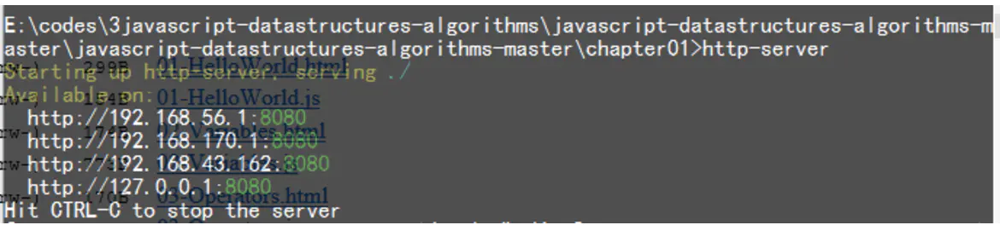

# nodejs一行命令快速启动一个web服务(两大神器：anywhere,http-server)

# **nodejs一行命令快速启动一个web服务(两大神器：anywhere,http-server)**

有时候我们在写一个简单的html测试代码的时候，需要使用一个web服务，通过浏览器：localhost:xxxx/index.html 访问自己的测试demo，在没有node的情况下，往往需要搭建Apache或者Tomcat服务（也有使用php等搭建），在此，在下分享最简单的方法，这也是node带给我们极大的方便之处。

关于node的安装，可直接下载node的安装包，双击安装即可，非常简单，大家可以直接查看node官网。

进入正题，_一行命令在项目文件根目录启动一个server_

### 方法一（anywhere）

### 安装

anywhere 安装非常简单，在安装了node，npm的前提下

npm install -g anywhere

复制代码

### 使用

安装完成之后直接在想要启动服务的文件夹下，打开命令行，输入anywhere回车即可启动。

指定启动端口：

anywhere 8888

复制代码

则会在8888端口启动

### 方法二（http-server）

### 安装

npm install http-server -g

复制代码

### 使用

安装完成之后直接在想要启动服务的文件夹下，打开命令行，输入http-server,即可开启

在浏览器输入上面显示的ip可端口即可访问。

http-server -c-1 也可启动，表示在禁止缓存情况下启用

http-server -p 8080                         // 当前目前下启动 8080 端口

http-server -p ./src/demo/ -p 9000         // 开启目录为当前目录的下一级 src/demo 目录 端口为 9000
