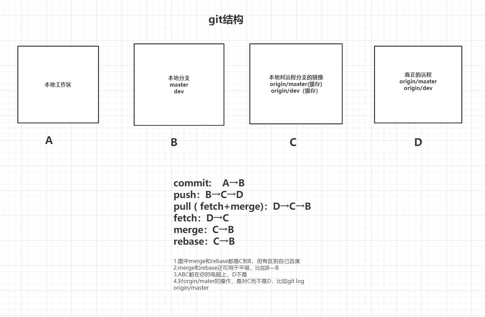
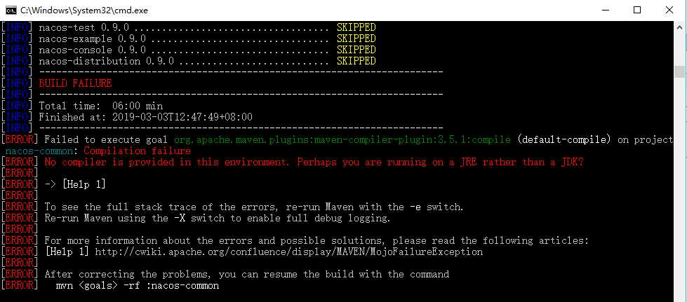
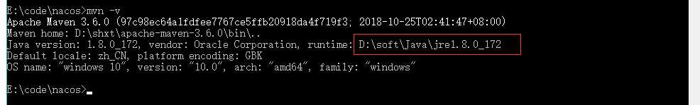
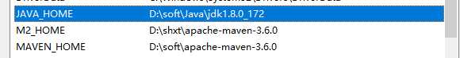
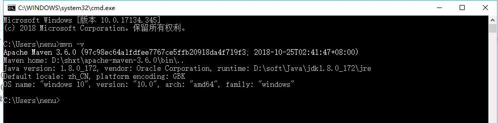

# cmd中mvn命令，出现No compiler is provided in this environment. Perhaps you are running

# **cmd中mvn命令，出现No compiler is provided in this environment. Perhaps you are running on a JRE rather than a JDK?**

# 在cmd里执行mvn命令，出错

# 查看mvn -v

# 发现mvn运行在jre上，更改高级设置。我的电脑--》属性--》高级系统设置--》环境变量

# 更改完之后，再次查看 mvn -v

# 搞定！！！！！！！！！！！！！！！！！！！！
