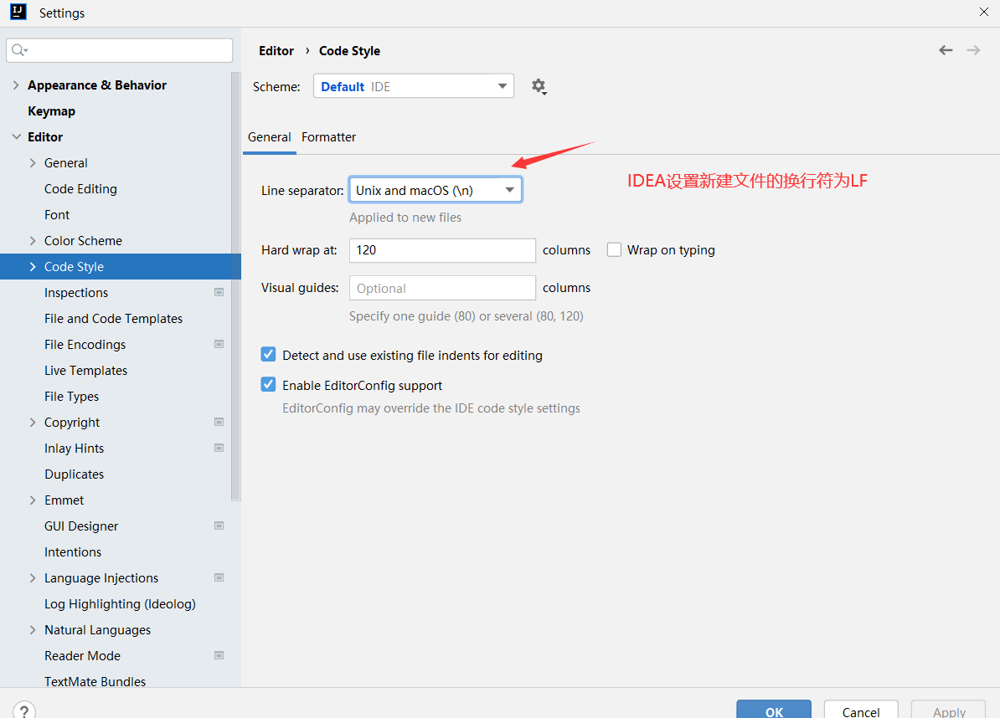

# 如何避免脚本或配置文件在git版本控制中换行符错乱

### 1.设置git拉取的文本文件换行符默认为LF

**设置：** git config --global core.autocrlf   input    （windows设备默认为true，建议设置为input）

**查看：**git config --global core.autocrlf

**解释：**

`core.autocrlf` 是 Git 的一个配置，用来控制 **换行符** 在不同系统（Windows、Linux、macOS）之间如何处理。

| 值      | 含义                               | 场景                                                       |
| ------- | ---------------------------------- | ---------------------------------------------------------- |
| `true`  | 检出时 LF → CRLF，提交时 CRLF → LF | Windows 常用（保证提交到仓库的文件是 LF，本地编辑是 CRLF） |
| `input` | 检出时不转换，提交时 CRLF → LF     | Linux/macOS 常用                                           |
| `false` | 检出和提交都不做任何转换           | 适合团队统一用同一种换行符                                 |

#### 2.设置idea新建文件的换行符为LF（**改变的默认的换行符仅针对新文件有效**）

