### 下载

在postgresql的官方即可找到源码文件目录，地址如下：https://www.postgresql.org/ftp/source/，在下载列表中根据需求选择版本,进入子目录后，可以看到文件列表：

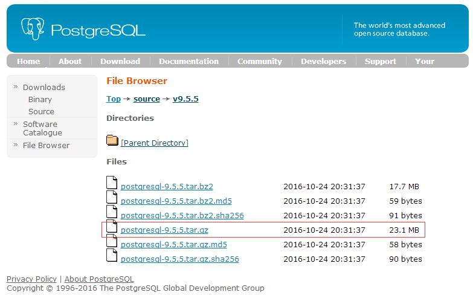

如上图，可以看到提供了两种压缩格式，此处我们选择**postgresql-9.5.5.tar.gz**，下载完成后上传至CentOS服务器的指定目录即可。

[回到顶部](https://www.cnblogs.com/feixiablog/p/9249454.html#_labelTop)

### 配置编译安装

首先进入pg压缩包目录通过**`tar -zxvf ./postgresql-9.5.5.tar.gz`**进行解压，然后就可以开始编译安装了，进入解压目录，通过**`./configure --help`**可以看到编译相关的帮助信息，如下图： 

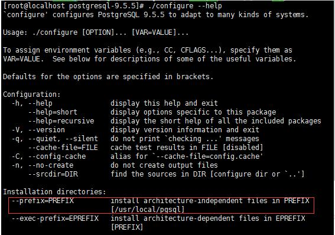

 

如上图，**`--prefix=dir`**可以指定安装目录，还有比如**`--with-python`**则可以使用python语法的PL/Python过程语言自定义函数，根据需求我们暂且用不到，所以编译时仅指定一个安装目录即可：

./configure --prefix=/usr/local/postgresql

 

运行编译后发现会**提示没有c编译器**，是因为新系统的原因，所以安装一个gcc编译器即可：

yum install gcc

 

安装完成后再次编译postgres，发现**提示缺少readline库**，如下图： 

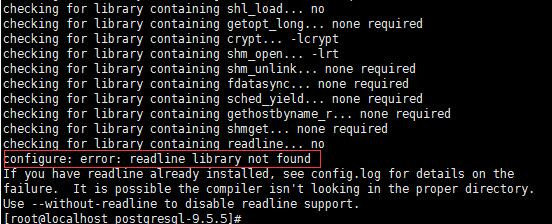

如上图，但是通过**`rpm -qa | grep readline`命令**查看可以发现系统默认是**自带readline包**的，如下图：

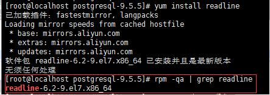

那么肯定还是缺少与readline相关的包了，通过`yum search readline`进行搜索可以发现一个readline-devel包，如下图：

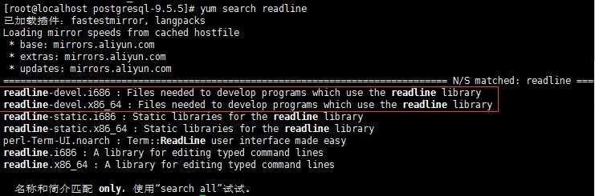

 

其实我们缺少的正是这个readline开发包（readline-devel），而不是readline包，所以接下来安装一下readline-devel：

yum install readline-devel

安装完成后再次编译postgresql，还是报错，这次提示缺少zlib库： 

 同理，缺少的依然是zlib开发包（zlib-devel）而并不是zlib包，所以继续安装zlib-devel：

yum install zlib-devel

 

安装完成后**再次编译postgresql**，并没有再报error，可以看到提示**创建了config.status配置文件**： 

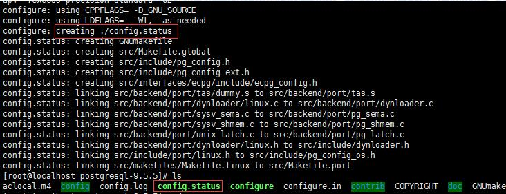

 

配置完成了，接下来就可以编译安装了，依次执行：

make  （耐心稍等片刻）
make install

 看到如下提示即可说明编译安装成功：

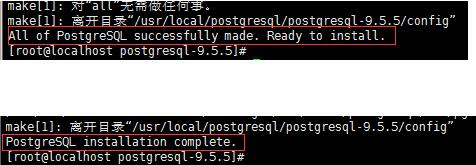

 

## 用户权限与环境变量

编译安装成功后，接下来要做的就是创建一个普通用户，因为默认超级用户（root）不能启动postgresql，所以需要创建一个普通用户来启动数据库，执行以下命令创建用户：

useradd postgres

接下来需要设置权限，将postgres的数据目录全部赋权给postgres用户（此处我将postgres的数据目录指定在在/usr/local/postgresql/data目录下）：

chown -R postgres:postgres /usr/local/postgresql/

 

最后为了方便起见设置一下相关的环境变量，此处仅仅**设置postgres用户的环境变量**，所以首先通过***`su - postgres`\***切换到postgres用户，打开文件并追加以下内容：

`su - postgres`

`vim ./.bash_profile`

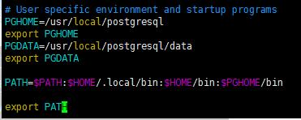

> 
>
> PGHOME=/usr/local/postgresql
> export PGHOME
> PGDATA=/usr/local/postgresql/data
> export PGDATA
>
> PATH=$PATH:$HOME/.local/bin:$HOME/bin:$PGHOME/bin
> export PATH


 

 修改完成后可以通过**`source ./.bash_profile`**使其立即生效，接下来检验一下环境变量是否设置正确，切换任意目录输入**`which psql`**以及**`psql -V`**即可分别查看psql客户端的路径以及postgresql的数据库版本，如下图： 

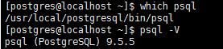

 

## 初始化数据库

由于配置了环境变量，所以此处我们直接执行`initdb`即可完成db初始化，但在这之前我们可以通过**`initdb --help`**看一下初始化相关的帮助信息： 

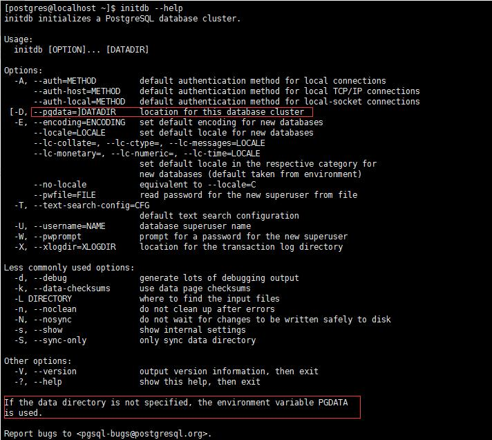

 

如上图，可以看到在使用`initdb`进行初始化的同时我们可以指定参数来同时进行一些初始化工作，

例如

**指定pgdata（postgresql数据目录）、**

**指定encoding（编码）、**

**指定数据库超级用户的用户名和密码等等**，

在最后面我标记出的这段话指出了如果data目录没有指定，**则会默认使用环境变量中的PGDATA**，由于之前我们刚刚设置了PGDATA环境变量，所以此处我们也就无需再额外指定，最后执行初始化命令即可：

\# initdb

 看到如下信息就说明初始化成功了： 

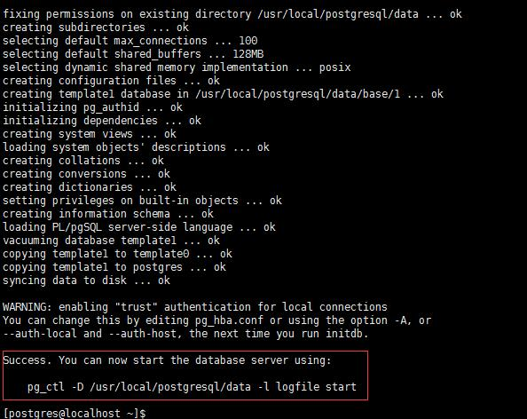

 

同时在postgresql的目录可以看到生成的数据目录data以及该目录的相关数据和配置文件：

```
cd  /usr/local/postgresql
```

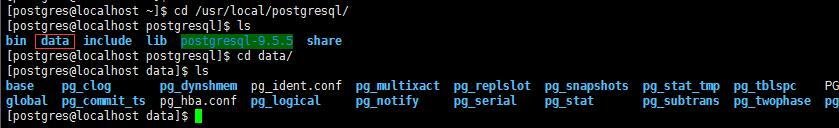

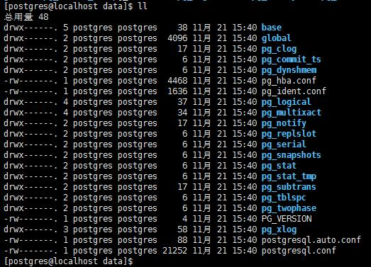

 

如上图，**base目录是表空间目录**，**global目录是相关全局变量的目录**

再执行  cd data

pg_hba.conf   一个是访问控制配置（127.0.0.1改为信任的客户端ip网段使其可以远程访问），

postgresql.conf  一个是postgresql主配置文件（listen_address=localhost改为星号使其监听整个网络），

方便起见我这里将pg_hba.conf的ip地址修改为`0.0.0.0/0`，而加密方式改为`md5`，就表示需要密码访问，算是提供一个最低级的安全防护： 

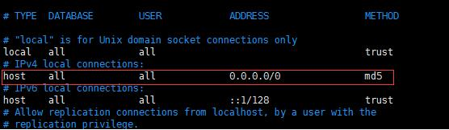

而postgresql.conf就像上面说的那样修改一下listen_address使其监听整个网络即可： 

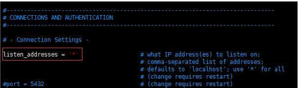

 

最后别忘记防火墙开放pg的5432端口，否则即使做了上面两处修改客户端依然无法连接postgresql，所以**将5432端口加入到zone即可**，依次运行以下命令（注意此处需要切回root用户，否则没有权限）：

firewall-cmd --zone=public --add-port=5432/tcp --permanent

firewall-cmd --reload

 

至此就配置完毕了，还可以通过`firewall-cmd --zone=public --list-ports`来查看已打开的端口列表再次确认一下:

firewall-cmd --zone=public --list-ports

 

## 启动和连接

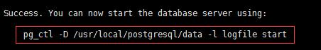

由于我们设置了环境变量，所以已经指定了数据目录PGDATA，`-l`表示日志文件目录，通常需要指定，所以我们在/usr/local/postgresql根目录下再创建一个log目录用来存放日志文件（注意别忘记赋予可写的权限）， 

mkdir  /usr/local/postgresql/log


最后运行**`pg_ctl start -l /usr/local/postgresql/log/pg_server.log`**即可启动数据库： 

通过**`ps -ef|grep postgres`**查看一下postgres相关是否存在相关进程，如下图也可以说明已启动成功： 

 

启动成功后我们就可以通过**postgresql自带的客户端工具psql**来进行连接，直接输入`psql`看到版本信息则说明连接成功： 

 

接下来要做的第一件事就是设置**postgres用户的密码（默认为空）**，用**psql连接成功**后直接输入**`\password`**即会提示输入两次密码，如下图：

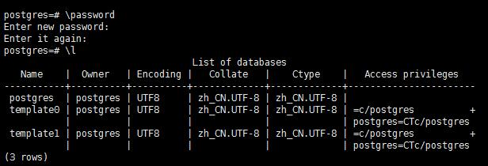


pg_ctl start -l /usr/local/postgresql/log/pg_server.log

重载配置： 

pg_ctl reload -D /usr/local/postgresql/data

停止：

pg_ctl stop