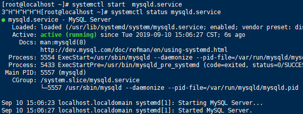
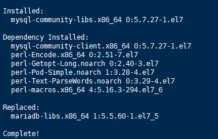
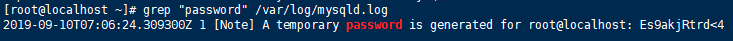
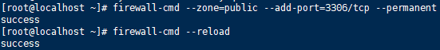

# cenos7安装mysql5.7步骤

在CentOS中默认安装有MariaDB，这个是MySQL的分支，但为了需要，还是要在系统中安装MySQL，而且安装完成之后可以直接覆盖掉MariaDB。

### **1 下载并安装MySQL官方的 Yum Repository**

wget -i -c http://[dev.mysql.com/get/mysql57-community-release-el7-10.noarch.rpm](http://dev.mysql.com/get/mysql57-community-release-el7-10.noarch.rpm)

使用上面的命令就直接下载了安装用的Yum Repository，大概25KB的样子，然后就可以直接yum安装了。

yum -y install mysql57-community-release-el7-10.noarch.rpm

之后就开始安装MySQL服务器。

yum -y install mysql-community-server

这步可能会花些时间，安装完成后就会覆盖掉之前的mariadb。

 

# **注意：这一步若报错，提示需要：libsasl2.so.2()(64bit)，或**

# **GPG密钥已安装，但是不适用于此软件包的**

# **请看下面的文�

[https://www.jianshu.com/p/0d9d32d8865f](https://www.jianshu.com/p/0d9d32d8865f)

[https://blog.csdn.net/weixin_53768277/article/details/124119115](https://blog.csdn.net/weixin_53768277/article/details/124119115)

至此MySQL就安装完成了，然后是对MySQL的一些设置。

### **2 MySQL数据库设置（****字符编码，密码策略等****）**

 首先启动MySQL

systemctl start mysqld.service(必须先启动不能改了my.cnf再启动!切记!)

查看MySQL运行状态，运行状态如图：

systemctl status mysqld.service

修改/etc/my.cnf

[mysqld]

#

# Remove leading # and set to the amount of RAM for the most important data

# cache in MySQL. Start at 70% of total RAM for dedicated server, else 10%.

# innodb_buffer_pool_size = 128M

#

# Remove leading # to turn on a very important data integrity option: logging

# changes to the binary log between backups.

# log_bin

#

# Remove leading # to set options mainly useful for reporting servers.

# The server defaults are faster for transactions and fast SELECTs.

# Adjust sizes as needed, experiment to find the optimal values.

# join_buffer_size = 128M

# sort_buffer_size = 2M

# read_rnd_buffer_size = 2M

datadir=/var/lib/mysql

socket=/var/lib/mysql/mysql.sock

# Disabling symbolic-links is recommended to prevent assorted security risks

symbolic-links=0

log-error=/var/log/mysqld.log

pid-file=/var/run/mysqld/mysqld.pid

validate_password_policy=0

character_set_server=utf8mb4

init_connect='set names utf8mb4'

lower_case_table_names=1

max_allowed_packet = 100M

sql_mode=STRICT_TRANS_TABLES,NO_ENGINE_SUBSTITUTION

# 性能参数调整

innodb_buffer_pool_size = 10000M

innodb_buffer_pool_instances = 1000M

max_connections = 3000

sort_buffer_size = 2M

back_log = 800

==============================================================

注意:

max_allowed_packet = 100M

sql_mode=STRICT_TRANS_TABLES,NO_ENGINE_SUBSTITUTION（5.7版本）

sql_mode=STRICT_TRANS_TABLES,ERROR_FOR_DIVISION_BY_ZERO,NO_AUTO_CREATE_USER,NO_ENGINE_SUBSTITUTION，IGNORE_SPACE  （8.0版本）

解释 ：

    字符集
    
    忽略字段大小写
    
    groupby问题：this is incompatible with sql_mode=only_full_group_by
    
    最大字段长度  max_allowed_packet
    
    忽略空格IGNORE_SPACE

重启数据库

systemctl restart mysqld

然后就ok了

**3修改mysql密码**

 此时MySQL已经开始正常运行，不过要想进入MySQL还得先找出此时root用户的密码，通过如下命令可以在日志文件中找出密码：

grep "password" /var/log/mysqld.log

 

如下命令进入数据库：

mysql -u root -p

输入初始密码（是上面图片最后面的 no;e!5>>alfg），此时不能做任何事情，因为MySQL默认必须修改密码之后才能操作数据库：

ALTER USER 'root'@'localhost' IDENTIFIED BY 'new password';

其中‘new password’替换成你要设置的密码，注意:如果没配置解除复杂密码，密码设置必须要大小写字母数字和特殊符号（,/';:等）,不然不能配置成功

#### 或使用mysqladmin修改密码

使用 mysqladmin 命令修改 MySQL 的 root 用户密码格式为 mysqladmin -u用户名 -p旧密码 password 新密码

### **4 开启mysql的远程访问**

执行以下命令开启远程访问限制（注意：下面命令开启的IP是 192.168.0.1，如要开启所有的，用%代替IP）：

grant all privileges on *.* to root@'%' identified by '密码' with grant option; 授权用户给所有

flush privileges; 写入数据库授权； （revoke 回收权限，具体咋写百度）

 注意:这之前要先确保my.cnf中bind-address的访问网址，将 bind-address=127.0.0.1 改成 bind-address=0.0.0.0

### **5 打开防火墙为firewalld添加开放端口（注意云服务器的控制台防火墙也要打开）**

添加mysql端口3306

firewall-cmd --zone=public --add-port=3306/tcp --permanent

然后再重新载入

firewall-cmd --reload

### 
