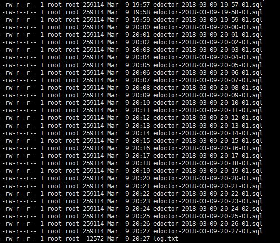

# centOS 下安装 ngnix（支持https）

# **centOS 下安装 ngnix（支持https）**

版权

## **Nginx 需要的安装环境**

如果不知道 linux/centOS 上是否安装了下面的软件，那么先尝试安装 Nginx ，如果安装的过程中出现问题，那么根据错误提示，安装相应的必要环境，例如：

./configure: error: the HTTP rewrite module requires the PCRE library.

./configure: error: the HTTP gzip module requires the zlib library.

1

2

**安装 gcc**

安装 Nginx 的编译环境 gcc

yum install gcc-c++

1

**安装 pcre pcre-devel**

nginx 的 http 模块使用 pcre 解析正则表达式，所以安装 perl 兼容的正则表达式库

yum install -y pcre pcre-devel

1

**安装 zlib**

nginx 使用 zlib 对 http 包的内容进行 gzip

yum install -y zlib zlib-devel

1

**安装 Open SSL**

nginx 不仅支持 http 协议，还支持 https（即在 ssl 协议上传输 http），如果使用了 https ，需要安装 OpenSSL 库

yum install -y openssl openssl-devel

1

## **Nginx 的安�**�

#### **  解压**

tar -zxvf nginx-1.21.6.tar.gz

1

#### **  配置**

**使用默认配置：**

cd nginx-1.21.6

./configure --with-http_ssl_module --with-stream --add-module=/root/nginx-rtmp-module-master

注意:此处按需安装模块

    

#### **  编译、安�**�

注意：使用默认配置时，nginx 被安装到 /usr/local/nginx 下。

make && make install

1

#### **  配置环境变量**

vim /etc/profile

1

    在合适位置添加环境变量

export NGINX_HOME=/usr/local/nginx

export PATH=$PATH:$NGINX_HOME/sbin

1

2

    重新编译 /etc/profile 文件

source /etc/profile

1

注意：重新编译文件时，如果会出现下面的问题

[root@pc-server1 nginx]# source /etc/profile

bash: id: command not found

bash: tty: command not found

1

2

3

此时说明在添加环境变量时，有单词写错了，或者是少写了 $PATH，此时需要重新修改 /etc/profile 文件，修改文件的命令改为

/bin/vi /etc/profile

1

然后断开 linux 连接，再重新连接即可。

## **Nginx 的运行**

因为将 Nginx 配置到了环境变量中，因此，在任何路径下都可以直接使用 nginx 命令，而不需要进入 nginx 路径下执行。

**启动**

./nginx

1

**查看 nginx 进程**

ps -ef | grep nginx

1

**关闭**

nginx -s stop

1

**重启**

nginx -s reload

1

**测试 nginx 配置脚本是否运行正常**

    通常可以通过这个命令查看 nginx 配置文件的位置

nginx -t

1

**nginx 开机自启**

    在 rc.local 文件中加入 /usr/local/nginx/sbin/nginx

vim /etc/rc.local

https配置示例：

    server {

        listen       443 ssl;

        server_name  [www.baidu.com;](http://www.baidu.com%3b/) #这里输入你的域名哦。

        ssl on;    

        ssl_certificate      cert/yourCA.pem;     #当前conf/目录下

        ssl_certificate_key  cert/yourCA.key;

        ssl_session_cache    shared:SSL:10m;

        ssl_session_timeout  5m;

        #ssl_server_tokens off;

        ssl_ciphers  ECDHE-RSA-AES128-GCM-SHA256:ECDHE:ECDH:AES:HIGH:!NULL:!aNULL:!MD5:!ADH:!RC4;

        ssl_protocols TLSv1 TLSv1.1 TLSv1.2;

        ssl_prefer_server_ciphers  on;

        location / {

            proxy_pass [http://127.0.0.1:8080;](http://127.0.0.1:8080;/) #映射到本地的Tomcat8080端口。

            proxy_redirect off;

            proxy_set_header Host $http_host;

            proxy_set_header X-Real-IP $remote_addr;

            proxy_set_header X-Forwarded-Proto https;

            proxy_set_header X-Forwarded-For $proxy_add_x_forwarded_for;

        }

        location /webSocket/ {

            proxy_pass [http://127.0.0.1:8080;](http://127.0.0.1:8080;/)

            proxy_http_version 1.1;

            proxy_set_header Host $http_host;

            proxy_set_header X-Real-IP $remote_addr;

            proxy_set_header X-Forwarded-For $proxy_add_x_forwarded_for;#主要是通过下方的两个属性来升级该请求，告诉服务器，我这个是webSocket请求。

            proxy_set_header Upgrade $http_upgrade;

            proxy_set_header Connection "Upgrade";

        }

    }

**切记：若443端口始终不通 可以按端口查找进程后kill掉 再重启nginx**
