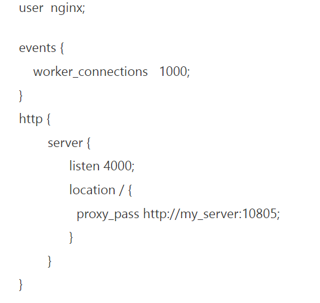
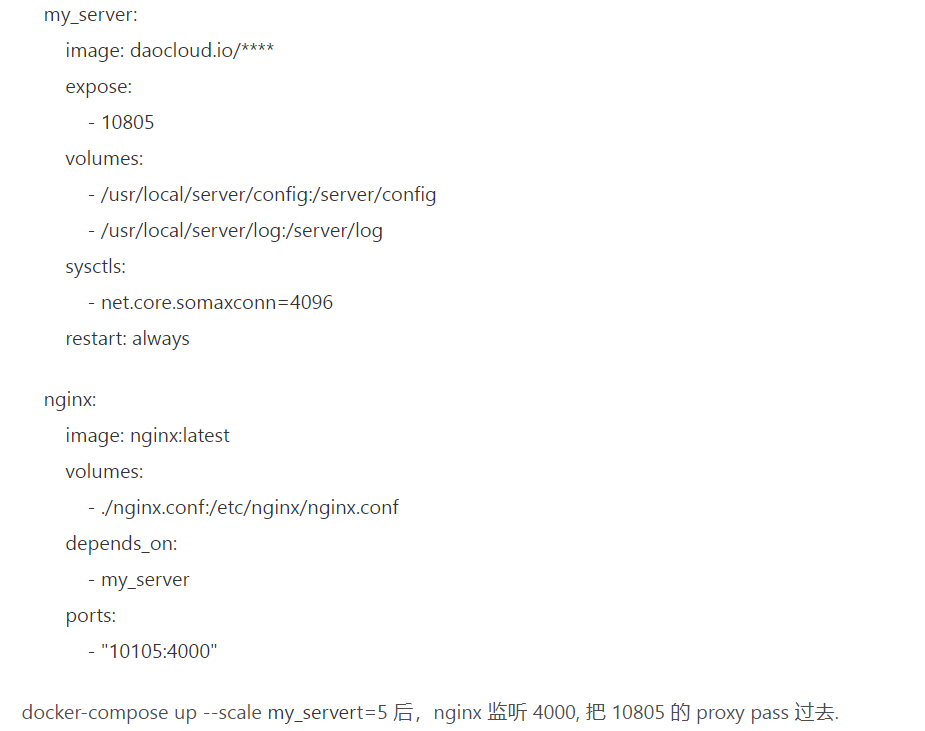

# depends_on不能保证前序容器完全初始化解决办法

depends_on,通常用于需要顺序启动不同镜像，比如后台需要等待数据库初始化完毕以后才启动，但是这个depends_on并不能保证前序容器完全初始化，意思是只要前序容器启动了，就会尝试启动当前容器。这样还是会造成前序容器未初始化完成，后续容器启动后出现连接失败等错误。 因此最好的方式是官方(https://docs.docker.com/compose/startup-order/)比较推荐的wait脚本，脚本的详细使用可以看这里

 https://github.com/vishnubob/wait-for-it, 

