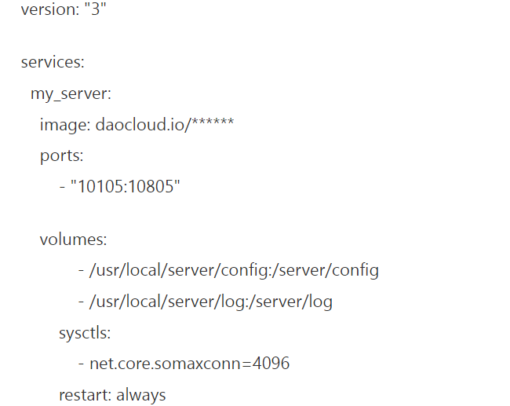

# docker compose scale 的时候解决端口冲突问题

# [docker compose scale 的时候解决端口冲突问题](https://my.oschina.net/u/3625745/blog/4452113)

比如这个情况，希望扩展多几个 docker, 但是简单 scale,5000 宿主机端口冲突，文件 docker-compose.yml 配置如下：

###     方法 1: 动态分配端口

ports 行改成 - “10805”  docker-compose up --scale my_server=3 然后 ps, 此时才能知道 3 个宿主机端口(

也可通过--1000-1010:10805提前知道映射的宿主机端口范围)

###     **方法 2: 加 nginx，**

###       

nginx:配置文件

compose文件(只指定暴露的端口)

**总结:在容器内网段直接访问****服务名****是自带负载均衡的 但是如果想要在容器网外访问(宿主机)  那么只能不同的容器映射不同的端口,再通过其他手段进行负载均衡**
