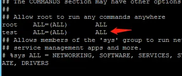

### 

#### 1. 创建一个具有root权限的其他账户(如果是openEuler系统安装时已经创建了用户,那么就不用创建了)

首先，你需要创建一个新的用户。例如，创建一个名为 `adminuser` 的用户：

```

useradd adminuser
```

#### 2. **为此用户设置密码**

为新用户 `adminuser` 设置密码：

```

passwd adminuser
```

系统会提示你输入并确认新密码。

#### 6. **直接添加到 `root` 组**

虽然不常见，但你也可以将用户直接添加到 `root` 组。虽然这不会使该用户成为 `UID 0` 的超级用户，但会给该用户与 `root` 组相关的文件系统权限。

```

usermod -aG root adminuser
```


##### 加入sudo的配置文件里

执行visudo

增加如下配置




##### 5.禁用本地root用户（此步骤只能禁止本地,无法禁止远程）

编辑/etc/pam.d/login文件，增加如下一行
 auth required pam_succeed_if.so user != root quiet


image.png


##### 4.禁止root远程登陆+修改ssh端口

vim /etc/ssh/sshd_config
 找到 # PermitRootLogin yes
 改为 PermitRootLogin no

 \#Port 22字段删掉#，将22改为其他不被使用的端口

##### 7.重启服务生效

systemctl restart sshd.service

