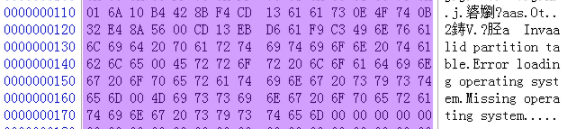

# 桌面运维系列之分区表、文件系统

一块新的电脑硬盘，我们通常需要对其进行“分区”之后，才能使用。

分区，就是把一块磁盘，分成多个区块来使用，我们常见的C盘、D盘等，就是分区的结果。

要对磁盘分区，使得电脑可以识别分区，人与电脑之间，得有一种约定（毕竟语言不通嘛），告诉电脑如何解读分区。

这种约定就是分区格式，目前有两种分区格式，MBR和GPT。

## MBR分区格式

MBR，全称Master Boot Record(主引导记录)，是传统的分区格式，如今新电脑都不再采用这种格式，但还有很多老电脑仍在使用。

我们知道，电脑上电后，BIOS开始自检。那么，自检完成后呢？对于MBR分区格式的电脑，当然是把MBR中的引导程序载入内存，并移交控制权。

在磁盘0头0柱1扇中的512个字节，保存的就是MBR。关于MBR格式说明，网上不要太多，下面只讲述作为运维人，应该重点注意的内容。

现在，我们需要建立一个概念——在MBR区域保存着一段引导代码，决定着电脑下一步应该怎么做。

我们来看下面的图，是MBR区域中的数据片段。

从中，我们可以看到几个文字：Invalid partition table(无效分区表）、Error loading operating system(加载操作系统错误）、Missing operatin system(失去操作系统）。

上面这些文字，是不是似曾相识？从此，当我们看到这些提示时，应该清楚了解我们的电脑，启动执行到了什么阶段，由于什么原因中断。

在MBR分区格式中，我们又把分区分为主分区（primary partition)、扩展分区(extended partition)和逻辑分区(logical partion)。

我们的C盘，通常为主分区。那么为什么会有扩展分区和逻辑分区呢？

这是因为，在MBR中一共64个字节的分区表描述中，用16个字节来描述分区表，最多只能描述4个分区表（4×16=64）。可我们需要划分4个以上的分区怎么办？这就是扩展分区的作用，我们可以把扩展分区理解为一个特殊的主分区，它是一个“指针”，指向一个逻辑分区描述表。有了扩展分区，我们就可以在其下划分逻辑分区，以达到分出更多分区的目的。

经典4分区结构：C(主分区)、D(扩展分区的逻辑分区)、E( 扩展分区的逻辑分区 )、F( 扩展分区的逻辑分区 )。

MBR分区格式还有个很大的限制：单分区容量无法超过2TB。这是因为描述分区位置的地方只有4个字节的限制。

## GPT分区格式

GPT，全称GUID partition table，即GUID分区表。GUID，Globally Unique Identifier,全球唯一标识符，是采用特殊算法生成的，理论上在全球都不会重复的一串符号。在GPT分区表中，每一个分区，都会分配一个GUID以对其唯一标识。

GPT的详细格式网上也很多，我们不再解释，需要了解的是它相对MBR的几个特性：

1、不受4分区限制；

2、单分区容量可以超过2TB；

3、分区工具diskpart、磁盘精灵等，可以将MBR分区格式转换为GPT格式，且不丢失数据，但反之会丢失数据；

## 文件系统

好了，有了分区格式的约定，电脑就可以识别磁盘上的区块了，但还不够。虽然有了区块，但区块中如何组织文件存放还是个问题，需要进一步进行约定，这就是文件系统的作用。

对于微软派，从DOS时代开始，到目前，出现以下文件系统格式：FAT、FAT16、FAT32、NTFS、exFAT、ReFS 。

FAT和FAT16已经很难见到了。

FAT32经常在U盘上见到，还有GPT磁盘格式安装windows系统时的ESP分区也是这个格式。FAT，全称 File Allocation Table，即文件分配表。

NTFS自然不用说，目前仍然是主流，其全称New Technology File System，是以NT为内核的windows系统所用的格式（之前还有9x内核）。

exFAT，是微软为其嵌入式操作系统引入的格式，适合闪存类存储介质。

ReFS是在 Windows Server 2012 中新引入的一个文件系统。

## 最后

说到分区格式，我们必须要提一下BIOS的引导模式Legacy和UEFI，前者是传统引导模式，需要磁盘分区格式为MBR格式。后者是现在流行的引导模式，需要磁盘分区格式为GPT。